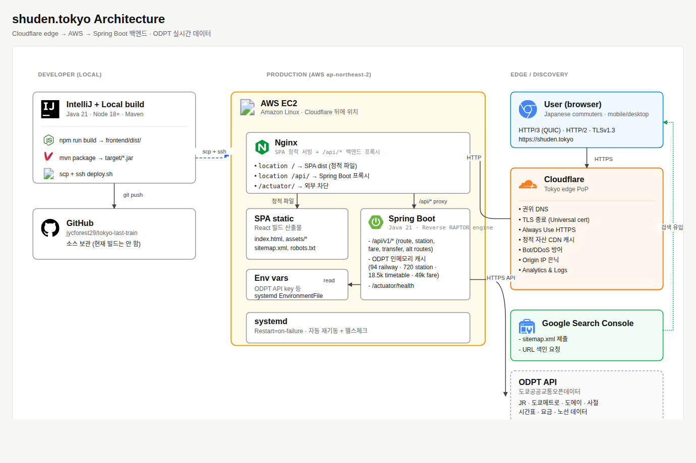
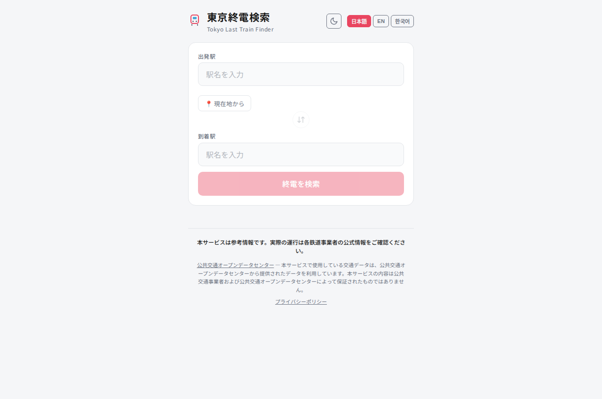
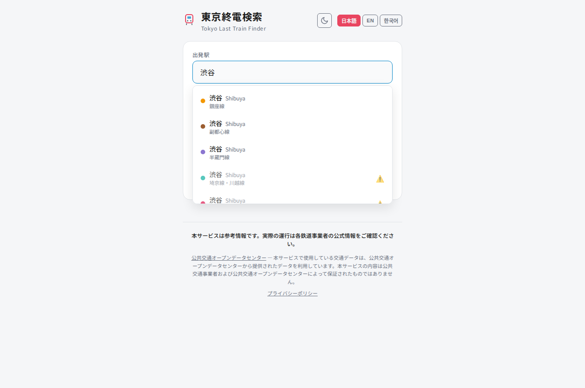
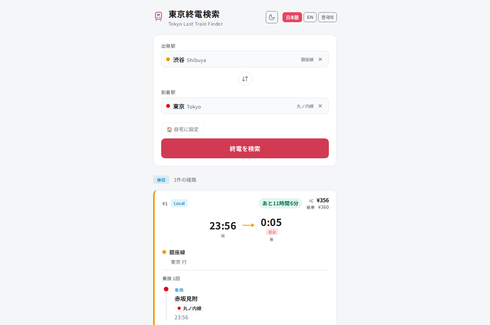
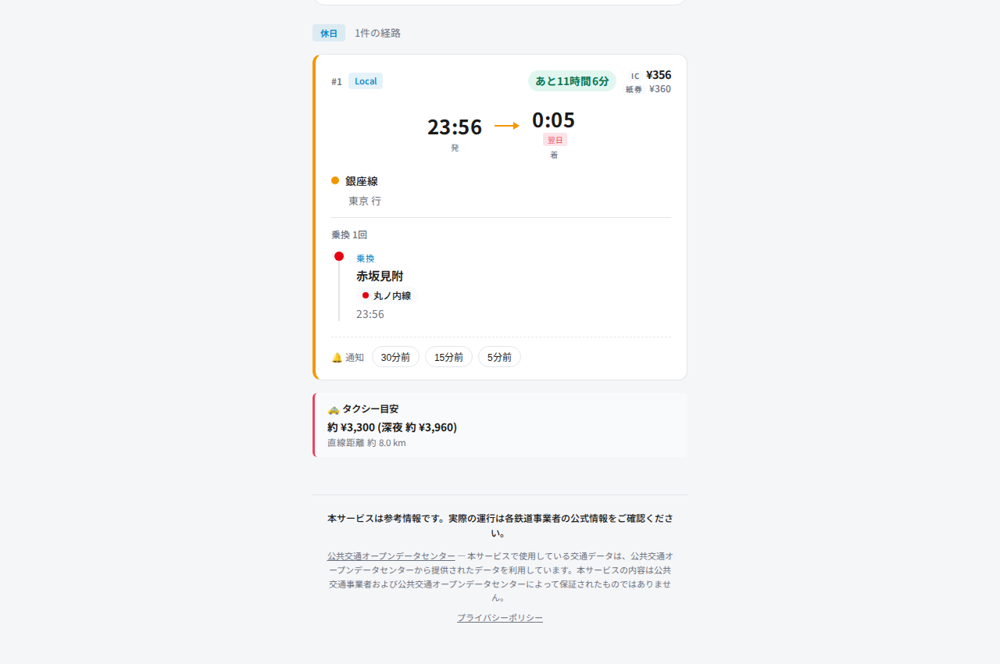
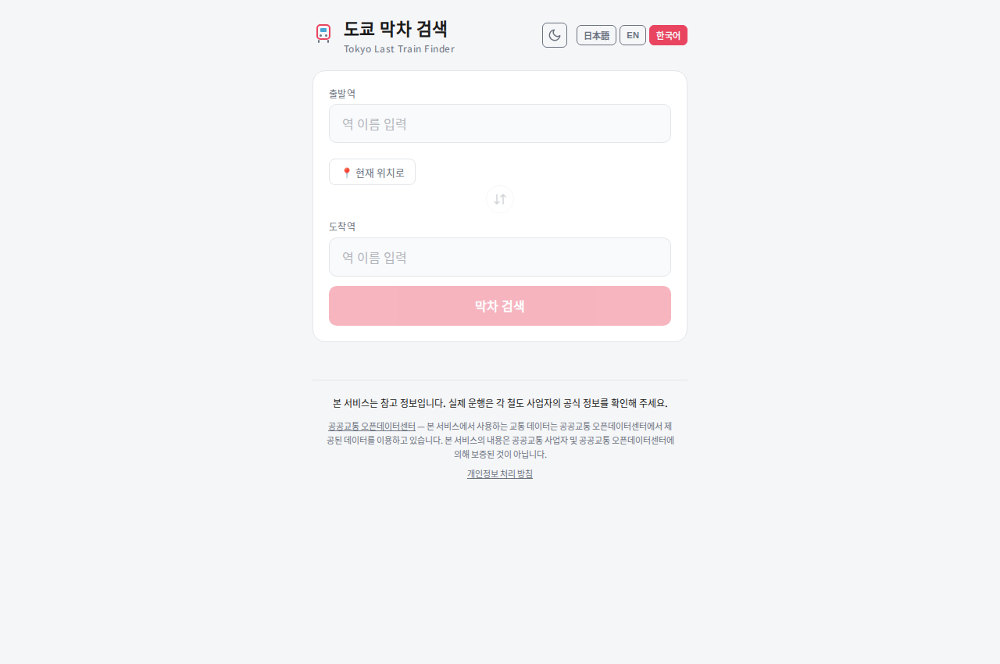

# Tokyo Last Train Finder

도쿄 수도권 전철망(지하철, JR, 사철)을 대상으로 출발역에서 도착역까지 **가장 늦게 출발할 수 있는 막차 경로**를 탐색하는 풀스택 웹 애플리케이션입니다.



## Live

**🌐 https://shuden.tokyo** — 라이브 서비스 (도쿄 시간 기준)

> 인프라: AWS EC2 (Seoul, ap-northeast-2) · Cloudflare Edge (Tokyo PoP) · Spring Boot + Nginx · 일본어 UI · PWA 설치 가능

## Screenshots

### 1. 메인 검색 화면


출발역·도착역을 입력하는 메인 폼.

일본어를 디폴트(`lang="ja"`)로 일본인 사용자 대상.

우상단에서 다크 모드 / 다국어(日本語/EN/한국어) 즉시 전환.

### 2. 역명 자동완성


"渋谷" 입력 시 노선별로 분리된 결과 — 銀座線·副都心線·半蔵門線·埼京線·川越線 각 플랫폼이 색상 점과 함께 별도 항목으로 노출.

시간표 데이터가 없는 역(예: 일부 사철)은 ⚠️ 표시.

300ms 디바운스 + `AbortController`로 이전 요청 자동 취소.

### 3. 막차 경로 결과 — 캘린더 자동 판별


渋谷 → 東京 검색 결과.

좌상단 **休日** 배지가 오늘이 공휴일임을 자동 감지 (こどもの日, ODPT `odpt:Calendar` 기반).

카드에 출발 23:56 → 도착 0:05(翌日), IC 운임 ¥356 / 종이표 ¥360, 銀座線 → 赤坂見附에서 丸ノ内線으로 환승 1회, 막차까지 남은 시간 "あと11時間6分" 표시.

### 4. 알림 + 택시 대안


같은 카드 하단 — **30/15/5분前 알림** 설정으로 막차 시간 다가올 때 브라우저 푸시.

막차 놓쳤을 때 대비해 **タクシー目安 약 ¥3,300 (심야 약 ¥3,960)** 직선거리 8.0km 자동 계산.

### 5. 다국어 즉시 전환


우상단 **한국어** 토글 한 번으로 전체 UI · ODPT 어트리뷰션 · 역명 보조 표기 모두 한국어로 전환.

일본어/영어/한국어 3개 언어 지원, 첫 진입 시 브라우저 `Accept-Language`로 자동 감지.

## Features

- **막차 경로 탐색** — 직통부터 최대 3회 환승까지, 가장 늦은 출발 시각의 최적 경로 도출
- **역 자동완성** — 일본어(히라가나/한자) 및 영어 입력 지원, 300ms 디바운스 적용
- **상세 경로 정보** — 출발/도착 시각, 운행 노선, 열차 종별(각정/쾌속 등), 환승역, 도보 이동 시간
- **요금 계산** — IC카드 기준 구간별 요금 자동 합산
- **캘린더 자동 판별** — 평일/토요일/공휴일 시간표를 날짜 기반으로 자동 선택, Fallback 로직 포함

## Reverse RAPTOR Algorithm

일반적인 RAPTOR 알고리즘이 출발역에서 도착역 방향으로 **가장 빠른 도착**을 찾는 반면, 이 프로젝트의 Reverse RAPTOR는 **도착역에서 출발역 방향으로 역탐색**하여 가장 늦은 출발 시각을 찾습니다.

```
Round 0: 도착역을 직통으로 연결하는 열차 역방향 스캔
Round 1: Round 0 결과 + 환승 1회 확장
Round 2: Round 1 결과 + 환승 2회 확장
Round 3: Round 2 결과 + 환승 3회 확장
```

**각 라운드 처리 흐름:**

1. **열차 역방향 스캔** — marked station을 지나는 모든 열차 시간표를 조회하고, 해당 열차의 이전 정차역들에 대해 "가장 늦은 출발 시각"을 갱신
2. **환승 전파** — 갱신된 역에서 환승 그래프를 통해 연결된 역으로 전파 (도보 환승 5분 감산)
3. **출발역 도달 확인** — 출발역이 갱신되었으면 해당 라운드의 최적 경로를 결과에 추가

**심야 시간 처리:**
- 24시, 25시 등 철도 시간 표기를 `LocalTime`으로 변환 (25:00 → 01:00)
- 새벽 1:30 이전 열차는 전일 운행분으로 판별

## Tech Stack

| Layer    | Stack                                                   |
|----------|---------------------------------------------------------|
| Backend  | Java 21, Spring Boot 3.4.4, Spring WebFlux, Jackson     |
| Frontend | React 19, TypeScript 5.9, Vite 8                        |
| HTTP     | Reactor Netty (WebClient, 256MB buffer, redirect follow) |
| Data     | ODPT API v4 (Dump API, 7 endpoints)                     |

## Getting Started

### Prerequisites

- Java 21
- Node.js 18+
- [ODPT API key](https://developer.odpt.org/) (무료 등록)

### Backend

```bash
export ODPT_API_KEY=your_api_key
mvn spring-boot:run
```

서버 기동 시 ODPT Dump API에서 전체 데이터를 로딩합니다 (초기 기동 약 2~3분 소요).
백엔드: `http://localhost:8080`

### Frontend

```bash
cd frontend
npm install
npm run dev
```

프론트엔드: `http://localhost:3000` (API 요청은 Vite 프록시로 백엔드에 전달)

## API

### Station Search

```
GET /api/v1/stations/search?query=shibuya
```

```json
{
  "stations": [
    {
      "stationId": "odpt.Station:TokyoMetro.Ginza.Shibuya",
      "nameJa": "渋谷",
      "nameEn": "Shibuya",
      "railway": "odpt.Railway:TokyoMetro.Ginza",
      "railwayNameJa": "東京メトロ銀座線",
      "railwayNameEn": "Ginza Line",
      "operator": "odpt.Operator:TokyoMetro",
      "latitude": 35.659,
      "longitude": 139.7016
    }
  ]
}
```

### Last Train Search

```
GET /api/v1/last-train?from=odpt.Station:TokyoMetro.Ginza.Shibuya&to=odpt.Station:JR-East.Yamanote.Tokyo
```

```json
{
  "fromStation": "odpt.Station:TokyoMetro.Ginza.Shibuya",
  "toStation": "odpt.Station:JR-East.Yamanote.Tokyo",
  "calendarType": "Weekday",
  "routes": [
    {
      "departureTime": "23:45",
      "arrivalTime": "00:12",
      "railway": "odpt.Railway:TokyoMetro.Ginza",
      "railwayNameJa": "東京メトロ銀座線",
      "railwayNameEn": "Ginza Line",
      "railDirection": "odpt.RailDirection:TokyoMetro.Asakusa",
      "trainType": "Local",
      "destinationNameJa": "浅草",
      "destinationNameEn": "Asakusa",
      "transfers": [],
      "totalFare": 200
    }
  ]
}
```

## Data Flow

```
[User Input] → StationInput (debounce 300ms)
    → GET /api/v1/stations/search → nameIndex lookup → autocomplete results

[Search Click] → SearchForm
    → GET /api/v1/last-train
    → resolveCalendar (date → Weekday/Saturday/Holiday)
    → ReverseRaptorEngine.findLastTrains()
        → Round 0~3: scanRoutesReverse() + transfer expansion
    → toRoute(): railway name, train type, fare calculation
    → LastTrainResponse (JSON)
    → RouteList → RouteCard + TransferStep (UI rendering)
```

## License

This project uses data from the [ODPT API](https://developer.odpt.org/). Please comply with their terms of use.
